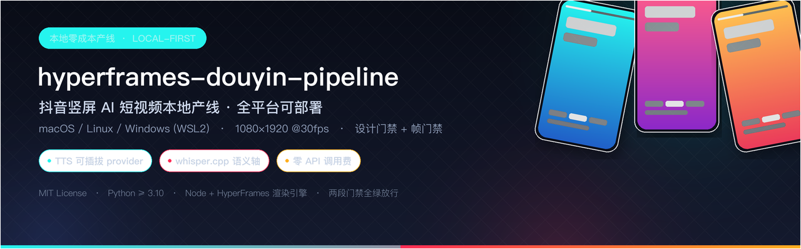

---
AIGC:
    Label: "1"
    ContentProducer: 001191440300708461136T1XGW3
    ProduceID: b82594f1be8e85c02fc42784acc7d5b8_67f6fb91c2f011f1884b525400cd780f
    ReservedCode1: 9vi7Sem0u8Ioi55R+T9Lf7KYz3iKn8fioBNZ5nNLVkTbaoNARRmW/IhJTvJIHYNBENnXIAWYdBGgjPkOgkB/Nel42JpchVCOBnAQmmKPqYfqs/ZqDcdndkTEXNgpYpJiNlrMrB5CTzu62Z+hwI0qF1vHevKHS56tQTIZfr0RrguKqAvNM1E1KQ1om5U=
    ContentPropagator: 001191440300708461136T1XGW3
    PropagateID: b82594f1be8e85c02fc42784acc7d5b8_67f6fb91c2f011f1884b525400cd780f
    ReservedCode2: 9vi7Sem0u8Ioi55R+T9Lf7KYz3iKn8fioBNZ5nNLVkTbaoNARRmW/IhJTvJIHYNBENnXIAWYdBGgjPkOgkB/Nel42JpchVCOBnAQmmKPqYfqs/ZqDcdndkTEXNgpYpJiNlrMrB5CTzu62Z+hwI0qF1vHevKHS56tQTIZfr0RrguKqAvNM1E1KQ1om5U=
---

<div align="center">
  
</div>

# hyperframes-douyin-pipeline

**抖音竖屏 AI 短视频本地产线**：一条 1080×1920 / 30fps 的竖屏成片流水线 —— 文案进，成片出，工具链全部跑在本地，**零 API 调用费**。渲染依赖 [HyperFrames](https://github.com/hyperframes/hyperframes)，配音走可插拔 TTS provider（默认可离线，也可切云端），质量由「渲染前设计门禁 + 渲染后帧门禁」两段自动把关。

[](LICENSE-MIT)
[](pyproject.toml)
[-lightgrey.svg)](#平台支持矩阵)
[](https://github.com/hyperframes/hyperframes)
[](#tts-provider-配置)
[](#常见问题)

> 徽章只声明本仓库可核验的事实（许可证、Python 版本、平台矩阵、渲染引擎、TTS provider 形态与成本模型）；未接入的 CI / 构建状态不做展示。

---

## 目录

- [这个仓库解决什么](#这个仓库解决什么)
- [核心特性](#核心特性)
- [平台支持矩阵](#平台支持矩阵)
- [产线架构](#产线架构)
- [快速开始](#快速开始)
- [使用](#使用)
- [仓库目录结构](#仓库目录结构)
- [已实机验证能力清单](#已实机验证能力清单)
- [质量门禁与不变量](#质量门禁与不变量)
- [Roadmap](#roadmap)
- [常见问题](#常见问题)
- [许可证与致谢](#许可证与致谢)
- [贡献](#贡献)

---

## 这个仓库解决什么

做竖屏短视频的常规做法是「剪辑软件 + 手工字幕」或「云端一键成片服务」。前者不可复现、不可批量；后者按次计费、内容出网、参数不可控。

本仓库走第三条路：**把出片过程写成代码**。

- **文案即数据**：`story/<name>/script.json` 声明标题、场景、字幕、TTS 参数，一集一文件，可 diff、可评审、可回滚。
- **画面即模板**：`index.html` 是竖屏 composition 源，配合 `templates/` 槽位化模板库，新建故事 = 复制模板 + 填槽位。
- **质量即门禁**：9 类产线检查（A1–A9）+ 两段门禁（渲染前 / 渲染后）以「阻断项 = 0」为放行条件，不通过就不出片；另含 **R2 跨边界对账层**（v1.16.0，advisory，`--strict-absorb` 可升级阻断）。
- **成本为零**：渲染用本机 Node + HyperFrames，配音默认走本地 TTS 模型，不产生 API 费用；需要更强音色时可切云端兼容档。

## 核心特性

| 能力 | 说明 |
|---|---|
| **两段门禁** | 段 1 `design_ai_gate`（渲染前设计检查）+ 段 2 `frame_audit`（渲染后帧级审计），阻断项为 0 才放行 |
| **默认画质档位** | 渲染按 `portrait-4k` 超采样（deviceScaleFactor=2）再收口到 1080×1920，配合视觉提亮，已默认化到产线代码 |
| **A1 情感节奏** | `beat` 声明驱动停顿档位与入场倍率，音频与画面双向对齐 |
| **A2 外观一致性锚点** | 渲染前登记锚点表，画面漂移即告警 |
| **A3 封面 × 标题 2×2** | 一次产出 4 张 1080×1920 封面备选 |
| **A4 语义轴** | whisper.cpp 回读成片音轨与稿子比对，检查语义一致性 |
| **A5 非确定段单列** | 静态扫描 + 帧级比对，识别渲染非确定性片段 |
| **A6 停顿检测** | 含音轨层 `silence_segments`，未声明的长停顿直接不通过 |
| **A7 光照阈值** | shot 级 `bg_base_lift` / `glow_gain` 覆写与越界阈值 |
| **A8 模板库槽位化** | `kind → template_story + slots.json`，`new` 后自动校验必填槽位 |
| **A9 去 AI 味 lint** | 连接词密度、套话、排比、句长方差等 12 类阈值 |
| **R2 跨边界对账层** | v1.16.0：`scripts/absorb_r2.py` 对真实留档跑 R1–R8 八项对账（终界锚 / 回执状态 / 判据溯源 / 三方对账），默认 advisory，`--strict-absorb` 可升级阻断 |
| **TTS 可插拔 provider** | 默认本地 `mlx`（Qwen3-TTS，Apple Silicon 零成本），可切 `openai` 兼容云端档；provider 由 `config/tts.json` 声明、`TTS_PROVIDER` 覆盖，凭据只读环境变量，**未配置即明确报错、不静默降级** |
| **跨平台工具链解析** | `scripts/platform_env.py` 统一解析 ffmpeg / ffprobe / node / hyperframes / whisper-cli 与中文字体（PATH + 平台常见目录 + 环境变量覆盖，Windows 自动补 `.exe`） |
| **仓库可整体搬迁** | `story/<name>/` 下 build 脚本按 `__file__` 自推导路径，`storyctl` 为每步子进程注入工具链 PATH，PATH 精简的 shell 也能跑通渲染 |
| **卡拉 OK 逐字字幕** | 逐字对齐 + 逐字高亮 |
| **片尾口播** | `build_audio` 生成结尾口播，`post_process` 拼接进成片 |
| **首次运行自检** | `scripts/doctor.py` 只读体检工具链 / 字体 / 不变量 / TTS provider |

## 平台支持矩阵

| 平台 | 状态 | 本地 TTS（`mlx`） | 云端 TTS（`openai` 兼容） | 说明 |
|---|---|---|---|---|
| **macOS（Apple Silicon）** | ✅ **已实机验证** | ✅ 可用（默认档） | ✅ 可用 | 端到端 `./scripts/storyctl.py build <story> --qc` 双门禁全绿 |
| macOS（Intel） | ⚠️ 未实机验证 | ❌ 不可用（`mlx` 需 arm64） | ✅ 可用 | 需显式切 `TTS_PROVIDER=openai` |
| **Linux（Debian / Ubuntu）** | ⚠️ 未实机验证（仅静态检查） | ❌ 不可用 | ✅ 可用 | 可复制命令见 [docs/DEPLOY.md](docs/DEPLOY.md) 第 4 节 |
| **Windows（WSL2 + Ubuntu）** | ⚠️ 未实机验证（仅静态检查） | ❌ 不可用 | ✅ 可用 | 推荐路径，命令与 Linux 完全一致 |
| Windows（原生 + Git Bash） | ⚠️ 未实机验证（仅静态检查） | ❌ 不可用 | ✅ 可用 | 非首选；产线含 POSIX shell 脚本 |

> 状态如实标注：除 macOS Apple Silicon 外均为**静态检查通过、未实机跑通**，未实机验证项与已知技术债的完整清单见 [docs/DEPLOY.md](docs/DEPLOY.md) 第 11 节。
> 不变量 **1080×1920 / 30fps** 与编码链在所有平台一致，`scripts/doctor.py` 会做只读校验。

## 产线架构

```
                    ┌─────────────────────────────────────────────────┐
输入                 │  story/<name>/                                  │
                    │    script.json   ← 文案 / 场景 / 字幕 / tts_params│
                    │    index.html    ← 竖屏 composition 源           │
                    └───────────────────────┬─────────────────────────┘
                                            │  ./scripts/storyctl.py build <name> [--qc]
        ┌───────────────────────────────────┴───────────────────────────────────┐
        │                                                                      │
        ▼                                                                      │
 ① build_audio.py          ② build_html.py              ③ hyperframes render   │
 文案 → TTS 语音            字幕 + 语音对齐               渲染（portrait-4k     │
 provider 可插拔           A2 锚点登记 / A7 光照覆写       超采样 + 视觉提亮）   │
 A1 节奏感知（beat）        A7 阈值校验                                        │
        │                        │                            │                │
        └────────────────────────┴────────────────────────────┘                │
                                 ▼                                              │
                        ④ post_process.py  ── 收口合同规格 1080×1920 / 30fps     │
                                 │                                              │
                                 ▼                                              │
                 ┌───────────────────────────────┐                              │
                 │  段 1 设计门禁 design_ai_gate │  ← 渲染前，阻断项 = 0 才继续  │
                 ├───────────────────────────────┤                              │
                 │  段 2 帧门禁 frame_audit      │  ← 渲染后，重跑亦走此入口      │
                 └───────────────┬───────────────┘                              │
                                 ▼                                              │
  --qc 串联质检： A1 节奏 → A6 停顿 → A4 语义轴（whisper.cpp）→ A5 非确定段 ──────┘
                                 │
                                 ▼
                    story/<name>/douyin.mp4          ← 成片 1080×1920 / 30fps
                    story/<name>/douyin_epilogue.mp4 ← 含片尾件 + 口播结尾
                    story/<name>/qc/                 ← 两段门禁 + 九项 KB 工作流报告
```

**跨平台适配层**（`scripts/platform_env.py` + `config/tts.json` + `scripts/tts_provider.py`）横切在 ①–④ 之下：所有工具路径、字体、TTS 驱动都从这一层解析，脚本内不再出现 `macOS` 绝对路径。

## 快速开始

完整的三平台可复制命令（macOS Homebrew / Linux apt 或 conda / Windows WSL2 与 Git Bash）见 **[docs/DEPLOY.md](docs/DEPLOY.md)**，含 TTS 环境变量逐项清单与排错表。最小路径如下：

```bash
# 0. 克隆（仓库可放在任意目录，脚本按仓库根推导路径）
git clone https://github.com/fatexx2013-ship-it/hyperframes-douyin-pipeline.git
cd hyperframes-douyin-pipeline

# 1. 工具链：ffmpeg / ffprobe、Node.js LTS + hyperframes、whisper.cpp（whisper-cli）、中文字体
ffmpeg -version && npx hyperframes --version && whisper-cli --help | head -3

# 2. Python 环境
python3 -m venv venv
source venv/bin/activate            # Windows Git Bash: source venv/Scripts/activate
pip install -U pip && pip install scipy

# 3. whisper.cpp 模型（不入库，需自行准备）
mkdir -p models && curl -L -o models/ggml-small.bin \
  https://huggingface.co/ggerganov/whisper.cpp/resolve/main/ggml-small.bin

# 4. TTS provider（二者择一；凭据只放环境变量，禁止入库）
#    A) 本地档 mlx（默认，仅 macOS Apple Silicon）
#       venv/bin/pip install mlx-audio
export TTS_MLX_MODULE_DIR=/absolute/path/to/tts-modules
export QWEN3_TTS_DIR=~/Projects/qwen3-tts-apple-silicon
#    B) 云端档 openai 兼容（全平台可用）
#       export TTS_PROVIDER=openai TTS_BASE_URL=... TTS_API_KEY=... TTS_MODEL=... TTS_VOICE=...

# 5. 首次运行自检（工具链 / 字体 / 不变量 / TTS）
python scripts/doctor.py
```

> `models/`、`venv/`、成片与音轨均不入库，每个部署点需自行准备。
> 工具装在非标准位置时用 `PIPELINE_<TOOL>` 覆盖，例如 `PIPELINE_WHISPER_CLI=/abs/path/whisper-cli`。
> 脚本以 755 执行位入库；若克隆 / 解压后执行位丢失，执行 `chmod +x scripts/*.py scripts/*.sh`。

## 使用

```bash
# 新建故事（按 kind 复制模板 + 注入槽位；kind 见 templates/registry.json）
./scripts/storyctl.py new my-story --kind short-chips

# 编辑 story/my-story/script.json 与 story/my-story/index.html

# 一键出片
./scripts/storyctl.py build my-story

# 带门禁质检出片（推荐）
./scripts/storyctl.py build my-story --qc

# 只跑门禁（成品已有，重跑质检）
./scripts/storyctl.py qc my-story

# 跨平台自检 / 查看选材目录
./scripts/storyctl.py doctor
./scripts/storyctl.py catalog voice
```

## 仓库目录结构

```
hyperframes-douyin-pipeline/
├── README.md                ← 本文件
├── PIPELINE.md              ← 产线总说明书
├── pyproject.toml           ← 项目元数据与依赖
├── LICENSE-MIT              ← MIT 许可证
├── assets/                  ← 项目展示资源（banner 等）
├── append_epilogue.py       ← 片尾口播拼接
├── post_process.py          ← 收口 1080×1920 / 30fps
├── epilogue_template.json   ← 片尾模板
├── scripts/                 ← 产线脚本集
│   ├── storyctl.py          ← 主控（new / build / qc / catalog / doctor）
│   ├── platform_env.py      ← 跨平台适配层（工具链 / 字体 / 环境变量覆盖）
│   ├── tts_provider.py      ← TTS 可插拔 provider（mlx / openai 兼容）
│   ├── doctor.py            ← 首次运行自检（只读：工具链 / 字体 / 不变量 / TTS）
│   ├── canon_guard.py       ← 规范守卫
│   ├── design_ai_gate.py    ← 段 1 渲染前门禁
│   ├── frame_audit.py       ← 段 2 渲染后门禁
│   ├── rhythm.py (A1)、anchors_check.py (A2)、make_covers.py (A3)
│   ├── semantic_axis.py (A4)、nondeterminism.py (A5)、pause_audit.py (A6)
│   ├── template_slots.py (A8)、deai_lint.py (A9)
│   ├── absorb_r2.py (R2 八项对账)、eof_anchor.py (R2 终界锚)
│   ├── render.sh、whisper_dtw.py、build_karaoke_ass.py、encode_profile.py …
├── config/                  ← 共享真源（canon / 参数合同 / 选择目录 / 工具链锁 / tts.json）
├── docs/                    ← DEPLOY.md 部署手册、产线规范.md、决策记录与技术债.md
├── templates/               ← 模板库（registry.json + 各 kind 模板 + _shared tokens/vendor）
├── story/<name>/            ← 每个故事：script.json、timing.json、index.html 源、build_*.py
└── tests/、tools/           ← 回归基线、fixtures、辅助工具
```

**不入库内容**（详见 `.gitignore`）：成片与音轨（`*.mp4` / `*.wav` / `*.mp3`）、渲染中间物（`story/*/renders/`、`covers/`、`qc/`）、`output/`、模型权重 `models/`、虚拟环境 `venv/`、脚本快照 `*.bak-*`，以及凭据文件 `config/api_keys.env`。

## 已实机验证能力清单

以下能力均已在 macOS Apple Silicon 上**真实跑通**（非静态推断）：

- [x] `./scripts/storyctl.py build <story> --qc` 端到端出片，双门禁报告**阻断项 = 0**
- [x] `scripts/doctor.py` 全项自检通过（工具链 / 中文字体 / 1080×1920 与 30fps 不变量 / TTS provider 可达）
- [x] 本地 `mlx` provider（Qwen3-TTS）走通配音链路；`openai` 兼容档参数校验通过
- [x] A1 情感节奏、A2 外观一致性锚点、A3 封面 × 标题 2×2、A6 停顿检测、A7 光照阈值、A8 模板槽位、A9 去 AI 味 lint 实际产出报告
- [x] R2 跨边界对账层（v1.16.0，产线真源实跑）：`absorb_r2.py check` rc=0、`selftest` 八项全绿、负控 39/39、故障注入命中；`storyctl qc` 段 1.7 接入（advisory 不改变两段门禁语义）。本仓库镜像下：锚点随运行自动生成，锚点缺失时 R1 报 `anchor_absent`、story `timing.json` 缺 `voice_start/voice_end` 时 R8 报 `schema_drift`，均为文档标注的预期行为（advisory 不拦，对应 v1.14/v1.15 层未同步）
- [x] A4 语义轴（whisper.cpp 回读音轨比对）、A5 非确定段单列
- [x] 卡拉 OK 逐字字幕与片尾口播拼接
- [x] 跨平台适配层：`git grep` 复核确认产线脚本内无 `macOS` 绝对路径残留
- [ ] Linux / WSL2 / Intel Mac 实机跑通（当前仅静态检查，见 [Roadmap](#roadmap)）

## 质量门禁与不变量

| 项目 | 约定 |
|---|---|
| 分辨率 / 帧率 | **1080×1920 / 30fps**，不变量，任何改动不得破坏 |
| 色彩空间 | BT.709，编码链在 `config/toolchain_lock.json` 锁定 |
| 放行条件 | 段 1 + 段 2 门禁 **阻断项 = 0**；存在阻断项即不出片 |
| 参数真源 | `config/param_contract.json`（版本化 + sha256 锁定），改动需同步 `toolchain_lock.json` |
| 共享真源改动 | `config/` 下的文件改动前先备份 `.bak-<日期>`（`*.bak-*` 已加入 `.gitignore`，不入库） |
| 凭据 | 一律走环境变量；仓库内不得出现任何 API Key / Token / 密码 |

## Roadmap

- [ ] **跨平台实机验证**：Linux（Debian/Ubuntu）、Windows WSL2、Intel Mac 跑通 `build --qc` 并回填上文矩阵状态
- [ ] **残留硬编码清理**：清理实验性 story（如 `story/easyvoice-intro`）内的绝对路径残留
- [ ] **配置去本地化**：`config/selection_catalog.json` 中本机绝对路径改为仓库内相对路径 / 可覆盖占位
- [ ] **Windows 原生链路**：将必要的 POSIX shell 步骤替换为 Python 实现，或明确声明仅支持 WSL2
- [ ] **CI 与回归**：接入跨平台 smoke 流程（`doctor.py` + 门禁冒烟），补齐单测覆盖
- [ ] **模板库扩充**：新增更多 `kind`（图表 / 榜单 / 科普）与配套槽位校验
- [ ] **一键多平台分发**：成片输出规格预设（竖屏多尺寸 / 封面文案批量）

## 常见问题

<details>
<summary><b>Q1. 我的平台（Linux / Windows）能用吗？</b></summary>

能。Linux 与 Windows 走 **WSL2** 是最推荐路径，云端 TTS 档（`openai` 兼容）全平台可用；本地 `mlx` 档仅 macOS Apple Silicon 可装。注意：除 macOS Apple Silicon 外的平台目前是**静态检查通过、尚未实机验证**，请以 [docs/DEPLOY.md](docs/DEPLOY.md) 的排错表为准，遇到问题欢迎提 Issue 回填验证状态。
</details>

<details>
<summary><b>Q2. 报错 <code>command not found</code> / rc=127？</b></summary>

多为工具链不在 PATH。三步排查：① `python scripts/doctor.py` 看哪一项缺失；② 用 `PIPELINE_<TOOL>` 显式指定绝对路径（如 `PIPELINE_WHISPER_CLI`、`PIPELINE_FFMPEG`）；③ 检查是否在 `venv` 内执行。详见 [docs/DEPLOY.md](docs/DEPLOY.md) 第 12 节排错速查。
</details>

<details>
<summary><b>Q3. 报 <code>Permission denied</code>？</b></summary>

执行位丢失（常见于 zip 下载或跨文件系统拷贝），执行 `chmod +x scripts/*.py scripts/*.sh` 即可。
</details>

<details>
<summary><b>Q4. 质检里 A4 语义轴被跳过？</b></summary>

A4 依赖 whisper.cpp（`whisper-cli`）与对应模型。未安装或未指定 `PIPELINE_WHISPER_CLI` 时该步会跳过并留下记录，属预期行为；要完整质检请补齐 whisper.cpp 与 `models/ggml-small.bin`。
</details>

<details>
<summary><b>Q5. Intel Mac 上 TTS 报错？</b></summary>

`mlx` 需要 arm64，Intel Mac 请改用云端档：`export TTS_PROVIDER=openai` 并配置 `TTS_BASE_URL` / `TTS_API_KEY` / `TTS_MODEL` / `TTS_VOICE`。provider 未配置时产线会明确报错，不会静默降级。
</details>

<details>
<summary><b>Q6. 为什么仓库里没有成片、模型和字体？</b></summary>

成片/音轨、渲染中间物、模型权重、虚拟环境均不入库（见 `.gitignore`），避免仓库体积膨胀与版权风险，每个部署点自行准备。中文字体使用系统自带（macOS PingFang SC / Linux Noto Sans CJK / Windows Microsoft YaHei），由适配层自动选择。
</details>

<details>
<summary><b>Q7. 我的文案会被上传到云端吗？</b></summary>

默认档 `mlx` 全程本地推理，内容不出网；只有显式切到 `openai` 兼容档时，文本才会发送到你配置的服务端点。凭据只读环境变量，不入库。
</details>

<details>
<summary><b>Q8. 为什么强调 1080×1920 / 30fps？</b></summary>

这是本产线的不变量：抖音竖屏成片规格与后续平台分发、封面、语义轴比对都以此为前提。`doctor.py` 与两段门禁都会校验；如需其他规格，请作为独立需求评估，不要直接改产线常量。
</details>

## 许可证与致谢

本项目以 [MIT License](LICENSE-MIT) 发布。

站在这些开源项目肩上：

- **[HyperFrames](https://github.com/hyperframes/hyperframes)** — HTML/React 驱动的视频渲染引擎，本产线的画面渲染核心
- **[FFmpeg](https://ffmpeg.org/)** — 音视频编解码与合成（含 `libass` 字幕烧录）
- **[whisper.cpp](https://github.com/ggerganov/whisper.cpp)** — 本地语音识别，A4 语义轴回读与逐字对齐
- **[mlx-audio](https://github.com/Blaizzy/mlx-audio) / Qwen3-TTS** — Apple Silicon 本地 TTS 档
- 以及 Node.js、Python（Pillow / NumPy / SciPy）等基础工具链

## 贡献

1. Fork 本仓库并创建功能分支：`git checkout -b feature/xxx`
2. 修改后运行 `./scripts/storyctl.py qc <story-name>` 验证门禁（阻断项需为 0）
3. 提交 PR，附出片截图或门禁报告摘要

**开发规范**

- 新工作流脚本放在 `scripts/` 下，以 `KB-Ax` / `kb_ax_` 前缀
- `config/` 为共享真源，改动前备份 `.bak-<日期>`（已加入 `.gitignore`）
- 1080×1920 / 30fps 为不变量，不得破坏
- 跨平台原则：新增脚本禁止硬编码平台绝对路径，工具与字体一律走 `scripts/platform_env.py` 解析
*（内容由AI生成，仅供参考）*
